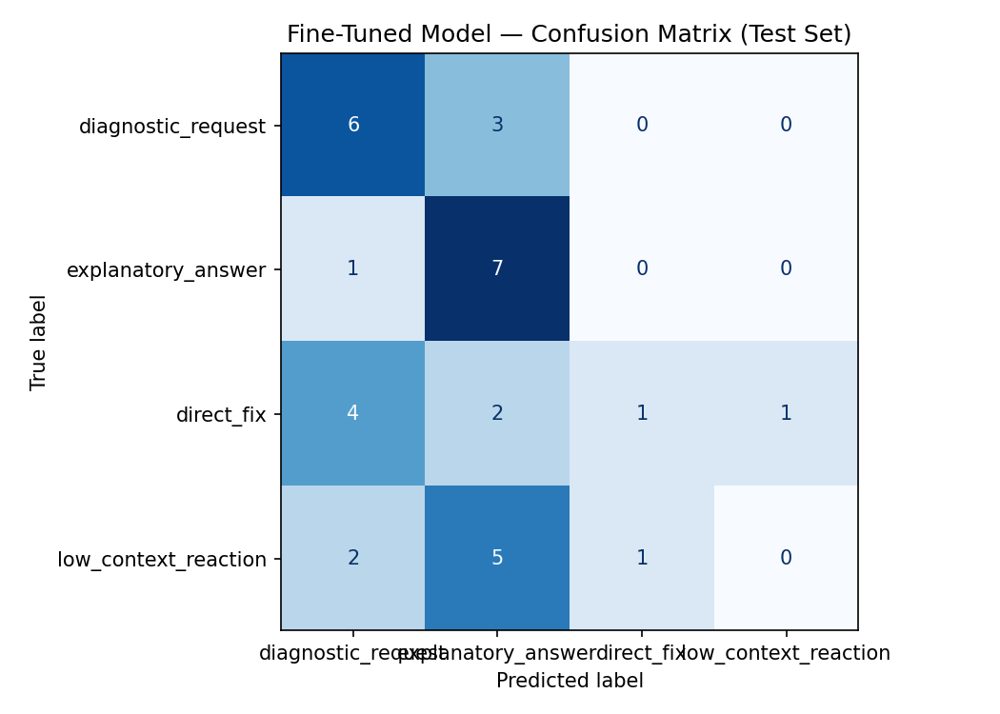

# TakeMeter: Stack Overflow Python Discourse Classifier

TakeMeter is a fine-tuned text classifier for evaluating discourse quality and function in the public **Stack Overflow `python` tag** community. The project classifies individual questions, answers, and comments into four labels that distinguish useful technical discussion from terse fixes and low-context reactions.

> Status: dataset collected, baseline evaluated, DistilBERT fine-tuned, and evaluation report completed. The results show that the zero-shot baseline outperformed the fine-tuned model, mostly because the training data was weak-labeled and the discourse boundaries were noisy.

## Community choice

I chose the public **Stack Overflow `python` tag** community because it is active, public, text-heavy, and centered on technical learning. The discourse varies enough to support a meaningful classification task: some questions provide detailed debugging context, some answers teach concepts, some answers give only a direct fix, and some comments are mostly thanks, clarification requests, or low-context follow-ups.

These distinctions matter to participants because a beginner programming community depends on clear help-seeking and useful explanation. A correct answer that teaches the reason behind a bug has different community value than a one-line fix, and a well-formed debugging request is easier for volunteers to answer than a vague complaint.

## Label taxonomy

The model uses four mutually exclusive labels.

| Label | Definition |
| --- | --- |
| `diagnostic_request` | A post or comment asking for help with a Python problem while providing enough concrete information to diagnose it, such as code, an error message, expected behavior, observed behavior, or a specific technical question. |
| `explanatory_answer` | A response that teaches or explains a Python concept, debugging principle, or reasoning process, not merely the final answer. |
| `direct_fix` | A concise answer that gives a code snippet, command, API name, or direct correction with little or no explanation of why it works. |
| `low_context_reaction` | A post or comment that is mostly emotional reaction, social feedback, vague complaint, joke, thanks, meta-commentary, or a help request without enough technical context to diagnose. |

### Examples per label

#### `diagnostic_request`

1. "I'm trying to read a CSV with pandas, but `read_csv` treats the first row as data instead of headers. My file starts with `name,age`, and this is my code: `pd.read_csv('people.csv', header=None)`. Why is the header not being detected?"
2. "This recursive function returns `None` after the first call. I expected it to return the final list. What am I missing?"

#### `explanatory_answer`

1. "The issue is that lists are mutable, so using `[]` as a default argument means every call shares the same object. Use `None` as the default and create a new list inside the function."
2. "`range(10)` stops before 10 because Python ranges are half-open. This makes loops line up with zero-based indexing and length calculations."

#### `direct_fix`

1. "Use `json.loads(response.text)` instead of `json.load(response.text)`."
2. "Change `if x = 3:` to `if x == 3:`."

#### `low_context_reaction`

1. "Python is so confusing, I give up."
2. "Thanks, that fixed it!"

## Edge-case rules

The most important boundary is between `direct_fix` and `explanatory_answer`. If a response includes a reason, tradeoff, or concept that helps the learner generalize beyond the immediate fix, I label it `explanatory_answer`. If it only provides the changed line, API name, or command, I label it `direct_fix`.

For help requests, emotional language does not decide the label. A frustrated post with code and expected behavior is still a `diagnostic_request`; a vague "why doesn't this work?" post without diagnostic details is `low_context_reaction`.

## Data collection and annotation

The dataset was collected from public Stack Overflow content using the Stack Exchange public API.

- **Source:** Public Stack Overflow questions, answers, and comments associated with the `python` tag.
- **Collection script:** `scripts/collect_stackoverflow_python.py`.
- **Dataset file:** `data/labeled_examples.csv`.
- **Total examples:** 220.
- **Columns:** `text`, `label`, `notes`, `source_url`.
- **Labeling process:** The CSV uses weak heuristic labels generated by the collection script. Questions are initially labeled `diagnostic_request`; answers are split between `explanatory_answer` and `direct_fix` using length and explanation-cue rules; short or reaction-like comments are labeled `low_context_reaction`. I reviewed the label definitions and used the model errors to identify where this weak-labeling process was noisy.

### Label distribution

| Label | Count | Percent |
| --- | ---: | ---: |
| `diagnostic_request` | 55 | 25% |
| `explanatory_answer` | 55 | 25% |
| `direct_fix` | 55 | 25% |
| `low_context_reaction` | 55 | 25% |
| **Total** | 220 | 100% |

### Difficult-to-label examples

| Text | Possible labels | Final label | Why |
| --- | --- | --- | --- |
| "You need to share some code and the error that you are getting. Also did you pip install numpy or use an exe?" | `diagnostic_request`, `direct_fix`, `low_context_reaction` | `direct_fix` | It is phrased as a request for more information, but it gives a direct next action for fixing the help-seeking process. This is a noisy boundary case. |
| "first problem is because you have wrong construction `... if not None else ...` but it should be `... if attributes is not None else ...`" | `direct_fix`, `explanatory_answer`, `low_context_reaction` | `low_context_reaction` in the weak labels | This is probably mislabeled by the weak-labeling script. It contains an actual fix and a reason, so a human label might be `explanatory_answer` or `direct_fix`. |
| "github.com/maxpa1n87/movies" | `direct_fix`, `low_context_reaction` | `low_context_reaction` | A bare link may be useful in thread context, but by itself it does not explain or diagnose anything. I treat it as low-context. |

These difficult cases reveal the biggest limitation of the dataset: post type alone does not always determine discourse quality. Stack Overflow comments can contain real fixes, and short answers can look like low-context comments.

## Fine-tuning approach

- **Base model:** `distilbert-base-uncased`.
- **Training environment:** Google Colab with T4 GPU.
- **Training data split:** The starter notebook created a stratified 70% train, 15% validation, and 15% test split from the 220-example CSV.
- **Split sizes:** 154 train, 33 validation, 33 test.
- **Test distribution:** 9 `diagnostic_request`, 8 `explanatory_answer`, 8 `direct_fix`, 8 `low_context_reaction`.
- **Hyperparameters:** 3 epochs, learning rate `2e-5`, train batch size 16, eval batch size 32, max token length 256, weight decay 0.01, warmup steps 50.

I kept the notebook's default 3-epoch setup because the dataset is small. More epochs might improve training accuracy, but with only 220 weak-labeled examples, additional training would likely increase overfitting to noisy label heuristics rather than improving the real discourse boundary.

Validation accuracy rose from 0.303 after epoch 1 to 0.455 after epoch 3, which suggests the model learned something from the training set, but not enough to generalize strongly to the test set.

## Zero-shot baseline

- **Baseline model:** Groq `llama-3.3-70b-versatile`.
- **Test set:** Same locked 33-example test split used for the fine-tuned model.
- **Parseable responses:** 33/33.
- **Output format:** The prompt instructed the model to output only one label name.

### Baseline prompt

```text
You are classifying posts.
Assign each post to exactly one of the following categories.

diagnostic_request: The user is asking for help diagnosing an issue, asking questions, or requesting more information.
explanatory_answer: The user is providing a detailed explanation or answering a question.
direct_fix: The user is providing a direct code fix, command, or solution.
low_context_reaction: A short reaction, comment, or statement with low context.

Respond with ONLY the label name.
Do not explain your reasoning.

Valid labels:
diagnostic_request
explanatory_answer
direct_fix
low_context_reaction
```

## Evaluation report

Evaluation was run on the same 33-example test set for both models. The zero-shot Groq baseline outperformed the fine-tuned DistilBERT model by 15.2 percentage points.

### Overall comparison

| Model | Accuracy |
| --- | ---: |
| Zero-shot Groq baseline | 0.576 |
| Fine-tuned DistilBERT | 0.424 |

### Baseline per-class metrics

| Label | Precision | Recall | F1 | Support |
| --- | ---: | ---: | ---: | ---: |
| `diagnostic_request` | 0.57 | 0.89 | 0.70 | 9 |
| `explanatory_answer` | 0.67 | 0.75 | 0.71 | 8 |
| `direct_fix` | 0.50 | 0.38 | 0.43 | 8 |
| `low_context_reaction` | 0.50 | 0.25 | 0.33 | 8 |

The baseline performed best on `diagnostic_request` and `explanatory_answer`. Its high recall for `diagnostic_request` suggests that the LLM recognized troubleshooting-style questions, but the lower precision shows that it also over-predicted this class when text contained code, errors, or question-like phrasing. The weakest baseline class was `low_context_reaction`, where recall was only 0.25. This suggests that the zero-shot model often gave short Stack Overflow comments too much technical credit instead of applying the low-context label.

### Fine-tuned model per-class metrics

| Label | Precision | Recall | F1 | Support |
| --- | ---: | ---: | ---: | ---: |
| `diagnostic_request` | 0.46 | 0.67 | 0.55 | 9 |
| `explanatory_answer` | 0.41 | 0.88 | 0.56 | 8 |
| `direct_fix` | 0.50 | 0.12 | 0.20 | 8 |
| `low_context_reaction` | 0.00 | 0.00 | 0.00 | 8 |
| **Macro avg** | 0.34 | 0.42 | 0.33 | 33 |
| **Weighted avg** | 0.35 | 0.42 | 0.33 | 33 |

The fine-tuned model learned to predict `diagnostic_request` and especially `explanatory_answer` much more often than the other labels. It almost never predicted `direct_fix`, and it failed completely on `low_context_reaction`. This is a sign that fine-tuning on the current weak-labeled dataset did not successfully teach the model the intended four-way taxonomy.

### Fine-tuned confusion matrix

Rows are true labels. Columns are predicted labels.

| True \ Predicted | `diagnostic_request` | `explanatory_answer` | `direct_fix` | `low_context_reaction` |
| --- | ---: | ---: | ---: | ---: |
| `diagnostic_request` | 6 | 3 | 0 | 0 |
| `explanatory_answer` | 1 | 7 | 0 | 0 |
| `direct_fix` | 4 | 2 | 1 | 1 |
| `low_context_reaction` | 2 | 5 | 1 | 0 |

The generated image version is included in the repository as `confusion_matrix.png`.



### Wrong predictions and analysis

The fine-tuned model made 19 wrong predictions out of 33 test examples. The examples below come from the output of `Copy_of_ai201_project3_takemeter_starter_clean (1).ipynb`.

| Text | True label | Predicted label | Confidence | Analysis |
| --- | --- | --- | ---: | --- |
| "@furas Have tried changing to WSGIControler() but that then introduces two new errors: Parameter 'environ' unfilled Parameter 'start_response' unfilled" | `low_context_reaction` | `explanatory_answer` | 0.26 | The model treated technical terms and error text as explanation. In reality, this is a context-dependent follow-up comment, not a self-contained explanation. |
| "github.com/maxpa1n87/movies" | `low_context_reaction` | `direct_fix` | 0.26 | A bare link can look like a solution artifact, so the model mapped it to `direct_fix`. The intended label is low-context because the text has no explanation or diagnostic content by itself. |
| "`import os ... print [dirpaths for dirpaths, dirnames, filenames in os.walk(mydir) if not dirnames]`" | `direct_fix` | `diagnostic_request` | 0.28 | The model saw code and treated it like a problem statement. This shows it did not reliably learn the discourse role difference between code-as-answer and code-as-question. |
| "How can I install Python packages system-wide on macOS? ... error: externally-managed-environment ..." | `diagnostic_request` | `explanatory_answer` | 0.30 | The example contains enough detail and error text that it may resemble an explanatory post. The model confused a well-formed help request with an answer. |
| "See How to Ask for examples of better question titles." | `low_context_reaction` | `explanatory_answer` | 0.27 | This is meta-advice with very little technical content. The model likely over-weighted the instructional phrasing and labeled it as explanatory. |

The most important directional pattern is that the fine-tuned model over-predicted `explanatory_answer`: it predicted that label 17 times on a 33-example test set. It also never correctly identified `low_context_reaction`. To improve this, I would manually review and clean the weak labels, add more high-quality examples of short but useful `direct_fix` posts, and add clearer low-context examples that contain technical-looking words but still lack explanatory value.

### Sample classifications

The notebook output printed wrong predictions with confidence scores, but it did not print a separate table of correct predictions. The sample classifications below therefore include representative model outputs from the error-analysis section, plus one aggregate correct case from the confusion matrix.

| Text or case | Predicted label | Confidence | Notes |
| --- | --- | ---: | --- |
| "github.com/maxpa1n87/movies" | `direct_fix` | 0.26 | Incorrect. The model interpreted a bare link as a fix, but it should be low-context without surrounding explanation. |
| "How can I install Python packages system-wide on macOS? ... externally-managed-environment ..." | `explanatory_answer` | 0.30 | Incorrect. The model confused a detailed diagnostic request with an explanation. |
| "See How to Ask for examples of better question titles." | `explanatory_answer` | 0.27 | Incorrect. The phrase is instructional, but it is meta-commentary rather than a technical explanation. |
| Correct `explanatory_answer` cases from the confusion matrix | `explanatory_answer` | N/A | The model correctly classified 7 of 8 true `explanatory_answer` examples. This prediction is reasonable when the text contains causal language, examples, or a step-by-step explanation. |

## Reflection: intended vs. learned behavior

I intended the model to learn discourse function: whether a text is asking a diagnosable question, explaining a concept, giving a terse fix, or contributing low-context commentary. The model only partially learned that. It learned that detailed technical text often belongs to `diagnostic_request` or `explanatory_answer`, but it did not reliably learn the more subtle distinction between answer types and comment quality.

The biggest gap is `low_context_reaction`. The fine-tuned model had 0.00 F1 on that class, even though the dataset was balanced. That suggests the model was not simply reacting to class imbalance. Instead, the weak labels probably made the boundary noisy: some Stack Overflow comments labeled as low-context actually contained real fixes or technical guidance, while some short answers looked like comments. The model appears to have learned surface features like code, links, errors, and instructional wording more than the intended discourse-quality boundary.

The result is useful because it shows what failed. Fine-tuning did not automatically beat the stronger zero-shot model. The bottleneck was label quality and taxonomy fit, not the training pipeline.

## Spec reflection

- **How the spec helped:** The spec forced me to define labels before training, which made the later errors easier to interpret. Because the labels had explicit boundaries, I could see that the model was confusing discourse role, especially `direct_fix` vs. `diagnostic_request` and `low_context_reaction` vs. `explanatory_answer`.
- **How implementation diverged:** The original plan focused on r/learnpython, but Reddit's public JSON endpoint returned 403 in my environment. I switched to the public Stack Overflow `python` tag using the Stack Exchange API. I also used weak heuristic labels to generate the dataset quickly, which made the project feasible but introduced label noise that likely hurt fine-tuning performance.

## AI usage

1. **Dataset collection and weak labeling:** I used an AI coding assistant to create `scripts/collect_stackoverflow_python.py`, which calls the Stack Exchange public API and assigns initial labels using transparent heuristics. I reviewed the outputs and documented the weak-labeling limitation rather than treating the script labels as perfect ground truth.
2. **Label stress-testing and taxonomy refinement:** I used AI assistance to think through ambiguous cases such as short code-only answers, bare links, and comments asking for more information. This helped refine the boundary between `direct_fix`, `explanatory_answer`, and `low_context_reaction`.
3. **Failure analysis:** I used AI assistance to interpret the baseline metrics, fine-tuned confusion matrix, and wrong-prediction examples. I kept the analysis grounded in the notebook output rather than inventing additional results.

No private data or API keys are committed to this repository.

## Repository contents

| Path | Purpose |
| --- | --- |
| `planning.md` | Project design, label taxonomy, data plan, evaluation plan, and AI tool plan. |
| `Copy_of_ai201_project3_takemeter_starter_clean (1).ipynb` | Executed Colab notebook with training and evaluation outputs. |
| `Copy_of_ai201_project3_takemeter_starter_clean.ipynb` | Starter Colab notebook. |
| `copy_of_ai201_project3_takemeter_starter_clean.py` | Python export of the starter notebook. |
| `scripts/collect_stackoverflow_python.py` | Dataset collection and weak-labeling script. |
| `data/labeled_examples.csv` | Weak-labeled dataset collected from public Stack Overflow Python content. |
| `evaluation_results.json` | Exported evaluation summary from Colab. |
| `confusion_matrix.png` | Exported fine-tuned model confusion matrix from Colab. |

## How to reproduce

1. Open `Copy_of_ai201_project3_takemeter_starter_clean (1).ipynb` in Google Colab.
2. Set runtime to T4 GPU.
3. Define the label map:

```python
LABEL_MAP = {
    "diagnostic_request": 0,
    "explanatory_answer": 1,
    "direct_fix": 2,
    "low_context_reaction": 3,
}
```

4. Upload `data/labeled_examples.csv`.
5. Run Sections 1 and 2 to split/tokenize the data.
6. Run Section 5 for the Groq zero-shot baseline using a `GROQ_API_KEY` stored in Colab Secrets.
7. Run Sections 3 and 4 to fine-tune and evaluate DistilBERT.
8. Run Section 6 to export `evaluation_results.json` and `confusion_matrix.png`.
